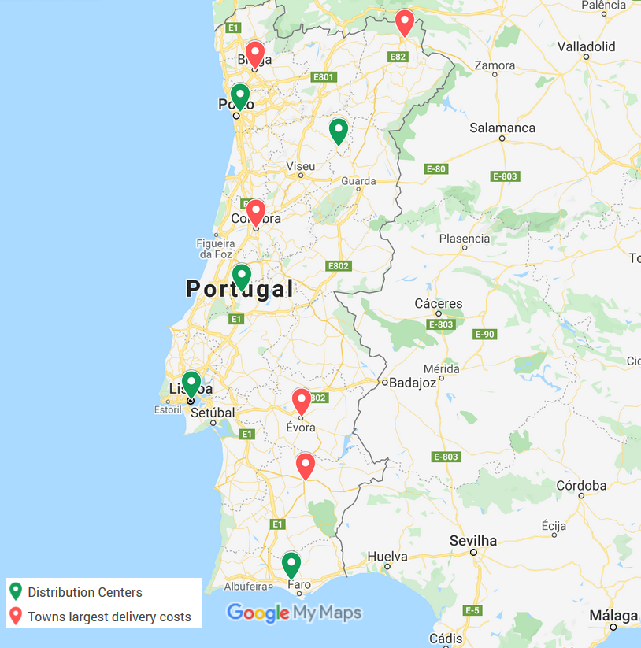

# Introduction

This problem consist in locating one or more facilities (DC) given a set of candidates towns.
The available dataset [1] contains population of each city and coordinates
allowing us to calculate the distances between them. Distance will reflect in delivery
costs for towns that are far away from distribution center.

The goal is to decide how many DCs along the country to locate (and where) 
constrained by a certain budget.
Our model is generic and works for both problems. The only difference is
the amount company can afford (budget) to open one or several DCs.

# Question 1

## Optimization Model

## Data

Name                                                               | Description
-------------------------------------------------------------------|-------------------------
$City$                                                             | set of cities
$latitude_{c}, \ c \in City$                                         | cities' latitudes
$longitude_{c}, \ c \in City$                                        | cities' longitudes
$population_{c}, \ c \in City$                                       | cities' population
$R$                                                                | earth radius (km)
$deliveries_{c} = \lceil{ 3 \frac{population_{c}}{1000} }\rceil$   | avg. anual deliveries of $c$ 
$distance_{c_{i} c_{j}}, c_{i},c_{j} \in City$                     | distance between $c_{i}$ and $c_{j}$
$yearly\_cost = 25000€$                                                     | yearly cost of opening a DC
$cost_{c_{i} c_{j}} = distance_{c_{i} c_{j}} \times cost_{c_{j}}$  | cost of deliveries from $c_{i}$ to $c_{j}$
$max\_dc = \frac{budget}{yearly\_cost}$                             | maximum no. of DCs to open given a budget (afford limit) 

Distance is given by the following formula:
$distance_{c_{i} c_{j}} =  2 \pi R \times \frac{\lvert latitude_{c_{j}} - latitude_{c_{i}} \rvert + \lvert longitude_{c_{j}} - longitude{c_{i}} \rvert }{360}$ 

For this question, we assume:
$budget = 25000€$
and therefore, $max\_dc = \frac{25000}{25000} = 1$.

Company can afford to open 1 DC only. 

## Variables

Name                                   | Description
---------------------------------------|-------------------------
$dc_{c} \in \{0,1\}$                   | DC is placed at city $c$ 
$deliver_{c_{i} c_{j}} \in \{0,1\}$    | DC at city $c_{i}$ delivers to city $c_{j}$

\pagebreak

## Formulation

\begin{center}
\begin{tabular}{ r l r r }
 $\hfill \text{minimize}$ & $\ z \equal \sum\limits_{c \in City}{dc_{c} \times yearly\_cost} + \sum\limits_{\substack{\\c_{i} \in City\\c_{i} \in City\\}}{deliver_{c_{i} c_{j}} \times cost_{c_{i} c_{j}}}$ & \ & $\hfill (1)$ \\
 
 \\
 
 $\text{subject to:}$ & $\sum\limits_{c \in City}{dc_{c}} \leq max\_dc,$ & \ & $\hfill (2)$ \\
 
 \\
 
 $\hfill$ & $\sum\limits_{\substack{\\i \in City\\}}{deliver_{c_{i} c_{j}}} \equal 1,$ & $\forall c_{j} \in City$ & $\hfill (3)$ \\
 
 \\
 
 $\hfill$ & $deliver_{c_{i} c_{j}} \leq dc_{i}$ & $\forall c_{i},c_{j} \in City$ & $\hfill (4)$ 
 
\end{tabular}
\end{center}

## Solution

Our model was implemented in GLPK. The solution can be obtained by running `$ ./solve_problem.sh 1`. 

Optimum cost $z$ is `3831575€` and the location of DC is `Santarém`.
The town with largest delivery costs `167036€` is `Lisbon` (from `Santarém`).

# Question 2

Our solution to question 2 use the same model for question 1. 
The only difference is the maximum amount of money (budget) that the company
is willing spend to open one or several DCs (max. 5 DCs equivalent to 125000€).

## Optimization Model

The model is analogue of the previous, except $budget = 125000€$. Therefore, $max\_dc = \frac{125000}{25000} = 5$.
Company is able to open 5 DCs.

## Solution

The solution can be obtained by running `$ ./solve_problem.sh 2`. 

Optimum cost $z$ is:

- `255836€` in `Lisbon` (DC)
- `67782€` in `Loulé` (DC)
- `156246€` in `Ourém` (DC)
- `265507€` in `Pedrouços` (DC)
- `119155€` in `Sernancelhe` (DC)

The towns with largest delivery costs for each DC listed above are:

- `255836€` is `Évora` (from `Lisbon DC`)
- `12070€` is `Beja` (from `Loulé DC`)
- `26200€` is `Coimbra` (from `Ourém DC`)
- `21418€` is `Braga` (from `Pedrouços DC`)
- `19004€` is `Bragança` (from `Sernancelhe DC`)

We conclude that `Évora` is the town with largest delivery costs.

# References

[1] [https://www.dcc.fc.up.pt/~jpp/mad1920/PopulationContPT-2020.csv](https://www.dcc.fc.up.pt/~jpp/mad1920/PopulationContPT-2020.csv)

# Appendix

{ width=500px }
